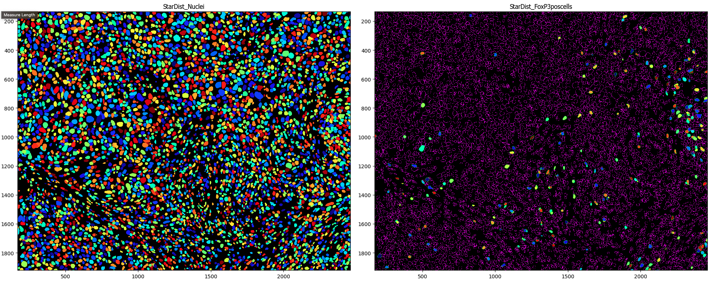
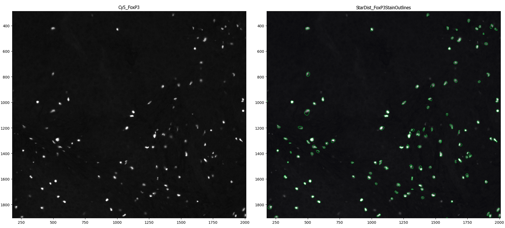
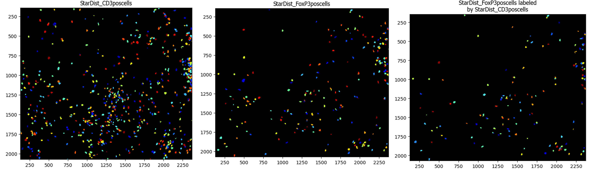

## Description of the purpose of each step of the image analysis pipeline along with example outputs

- [Description of the purpose of each step of the image analysis pipeline along with example outputs](#description-of-the-purpose-of-each-step-of-the-image-analysis-pipeline-along-with-example-outputs)
  - [1. RunStarDist](#1-runstardist)
  - [2. OverlayOutlines](#2-overlayoutlines)
  - [3. IdentifySecondaryObjects](#3-identifysecondaryobjects)
  - [4. IdentifyTertiaryObjects](#4-identifytertiaryobjects)
  - [5. Threshold](#5-threshold)
  - [6. Maskobjects](#6-maskobjects)
  - [7. OverlayOutlines](#7-overlayoutlines)
  - [8. Threshold](#8-threshold)
  - [9. Maskobjects](#9-maskobjects)
  - [10. OverlayOutlines](#10-overlayoutlines)
  - [11. Relate Objects](#11-relate-objects)
  - [12. Overlay Outlines](#12-overlay-outlines)
  - [13. Measure Object Intensity](#13-measure-object-intensity)
  - [14. Measure Colocalization](#14-measure-colocalization)
  - [15. Gray to Color](#15-gray-to-color)
  - [16. Overlay Outlines](#16-overlay-outlines)
  - [17. Save Images](#17-save-images)
  - [18. Export to Spreadsheet](#18-export-to-spreadsheet)

### 1. RunStarDist
Use the StarDist algorithm (https://github.com/stardist/stardist) to segment nuclei

### 2. OverlayOutlines
Check the accuracy of the outlines of the nuclei segmented by RunStarDist

### 3. IdentifySecondaryObjects
Segment the whole cell outlines

### 4. IdentifyTertiaryObjects
Segment cytoplasm (whole cells minus the nuclei)

### 5. Threshold
Set the intensity threshold for deeming cells as marker (CD3) positive

### 6. Maskobjects
Keep the thresholded areas of the image using a mask and identify the cells present in those areas

### 7. OverlayOutlines
Check the accuracy of detecting CD3+ cells by overlaying the outlines of the CD3+ cells on the grayscale FITC image

### 8. Threshold
Set the intensity threshold for deeming cells asd marker (FoxP3) positive

### 9. Maskobjects
Keep the thresholded areas of the image using a mask and identify the cells present in those areas

### 10. OverlayOutlines
Check the accuracy of detecting FoxP3 cells by overlaying the outlines of the CD3+ cells on the grayscale FITC image

### 11. Relate Objects
Associate the CD3+ cells (parent objects) to the FoxP3+ cells (child objcets)

### 12. Overlay Outlines

### 13. Measure Object Intensity

### 14. Measure Colocalization

### 15. Gray to Color

### 16. Overlay Outlines

### 17. Save Images

### 18. Export to Spreadsheet

