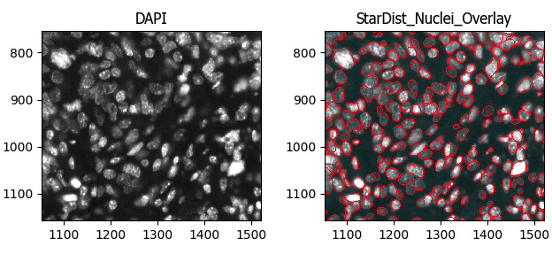

## Description of the purpose of each step of the image analysis pipeline along with example outputs

- [Description of the purpose of each step of the image analysis pipeline along with example outputs](#description-of-the-purpose-of-each-step-of-the-image-analysis-pipeline-along-with-example-outputs)
  - [1. RunStarDist](#1-runstardist)
  - [2. OverlayOutlines](#2-overlayoutlines)
  - [3. IdentifySecondaryObjects](#3-identifysecondaryobjects)
  - [4. IdentifyTertiaryObjects](#4-identifytertiaryobjects)
  - [5. Threshold](#5-threshold)
  - [6. Maskobjects](#6-maskobjects)

### 1. RunStarDist
Use the StarDist algorithm (https://github.com/stardist/stardist) to segment nuclei

### 2. OverlayOutlines
Check the accuracy of the outlines of the nuclei segmented by RunStarDist

### 3. IdentifySecondaryObjects
Segment the whole cell outlines

### 4. IdentifyTertiaryObjects
Segment cytoplasm (whole cells minus the nuclei)

### 5. Threshold
Set the intensity threshold for deeming cells asd marker positive

### 6. Maskobjects
Keep the thresholded areas of the image using a mask and identify the cells present in those areas

