## Description of the purpose of each step of the image analysis pipeline along with example outputs

- [Description of the purpose of each step of the image analysis pipeline along with example outputs](#description-of-the-purpose-of-each-step-of-the-image-analysis-pipeline-along-with-example-outputs)
  - [1. Correct Illumination Calculate and Apply](#1-correct-illumination-calculate-and-apply)
  - [2. RunStarDist](#2-runstardist)
  - [2. OverlayOutlines](#2-overlayoutlines)
  - [3. IdentifySecondaryObjects](#3-identifysecondaryobjects)
  - [4. IdentifyTertiaryObjects](#4-identifytertiaryobjects)
  - [3. IdentifySecondaryObjects](#3-identifysecondaryobjects-1)
  - [4. IdentifyTertiaryObjects](#4-identifytertiaryobjects-1)
  - [5. Threshold](#5-threshold)
  - [6. Maskobjects](#6-maskobjects)
  - [7. OverlayOutlines](#7-overlayoutlines)
  - [8. Threshold](#8-threshold)
  - [9. Maskobjects](#9-maskobjects)
  - [10. OverlayOutlines](#10-overlayoutlines)
  - [11. Relate Objects](#11-relate-objects)
  - [12. Overlay Outlines](#12-overlay-outlines)
  - [13. Measure Object Intensity](#13-measure-object-intensity)
  - [14. Measure Colocalization](#14-measure-colocalization)
  - [15. Gray to Color](#15-gray-to-color)
  - [16. Overlay Outlines](#16-overlay-outlines)
  - [17. Save Images](#17-save-images)
  - [18. Export to Spreadsheet](#18-export-to-spreadsheet)

### 1. Correct Illumination Calculate and Apply
Calculates and applies an illumination function to the images to correct for uneven illumination in the images of SMA-staining. The method 'Background' was selected to correct for the high background staining in some of the images of the SMA-stain (Texas Red).

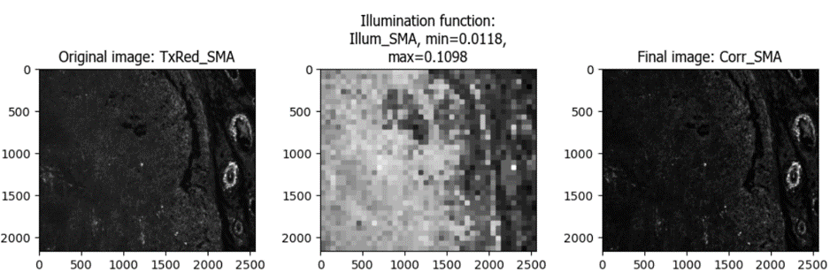

### 2. RunStarDist
Uses the StarDist algorithm (https://github.com/stardist/stardist) to segment nuclei

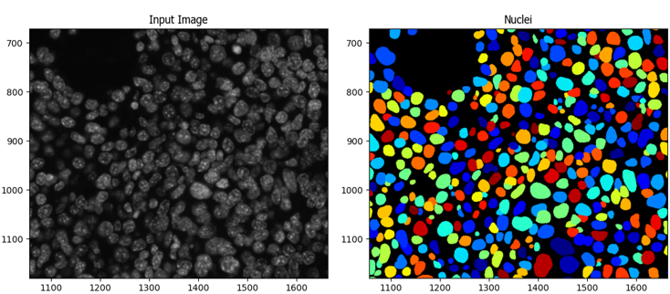

### 2. OverlayOutlines
Checks the accuracy of the outlines of the nuclei segmented by RunStarDist

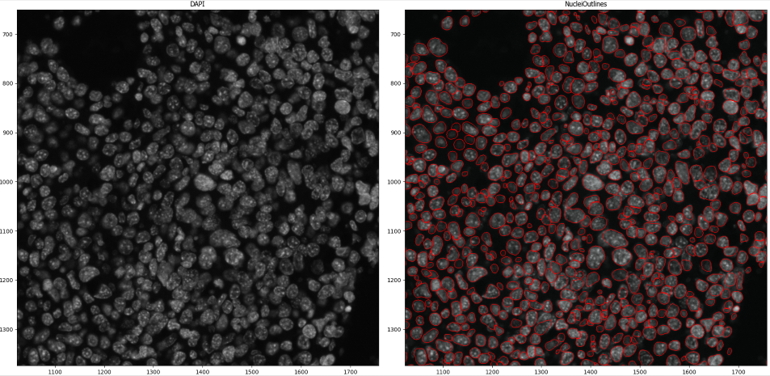

### 3. IdentifySecondaryObjects
Segments the whole cell outlines

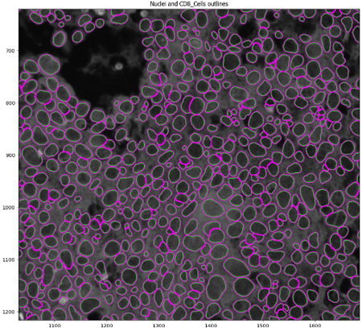

### 4. IdentifyTertiaryObjects
Segments cytoplasm (whole cells minus the nuclei)

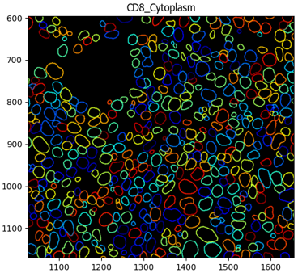

### 3. IdentifySecondaryObjects
Segments the whole cell outlines

### 4. IdentifyTertiaryObjects
Segments cytoplasm (whole cells minus the nuclei)

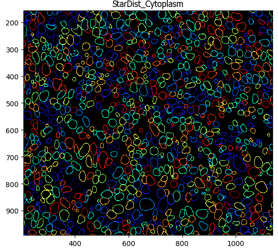

### 5. Threshold
Sets the intensity threshold for deeming cells as marker (CD3) positive

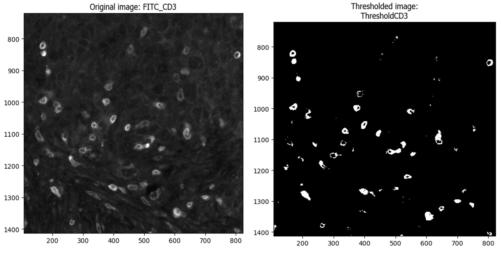

### 6. Maskobjects
Keeps the thresholded areas of the image using a mask and identify the cells present in those areas

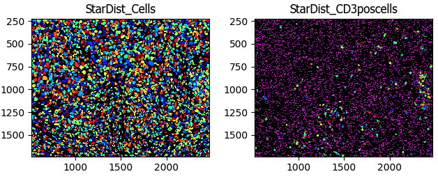

### 7. OverlayOutlines
Checks the accuracy of detecting CD3+ cells by overlaying the outlines of the CD3+ cells on the grayscale FITC image

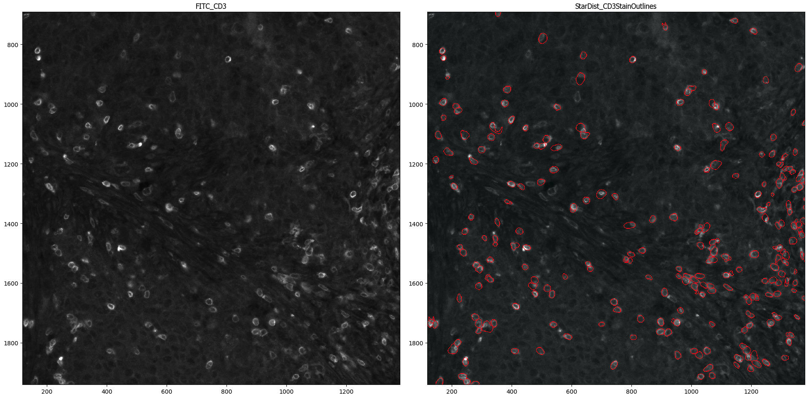

### 8. Threshold
Sets the intensity threshold for deeming cells as marker (FoxP3) positive

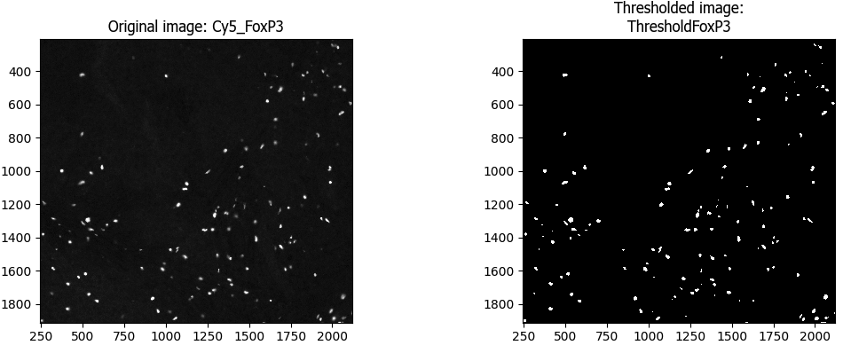

### 9. Maskobjects
Keeps the thresholded areas of the image using a mask and identifies the cells/nuclei present in those areas

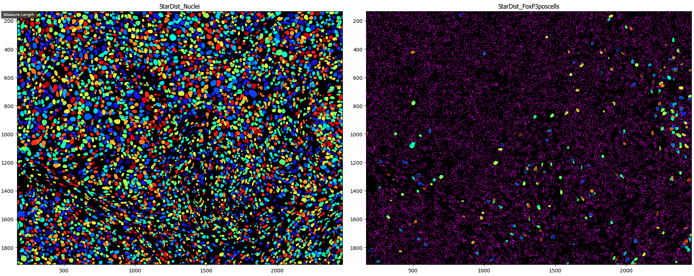

### 10. OverlayOutlines
Checks the accuracy of detecting FoxP3+ cells by overlaying the outlines of the FoxP3+ cells on the grayscale Cy5 image

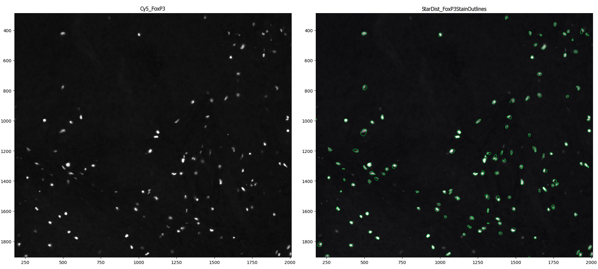

### 11. Relate Objects
Associates the CD3+ cells (parent objects) to the FoxP3+ cells (child objcets)

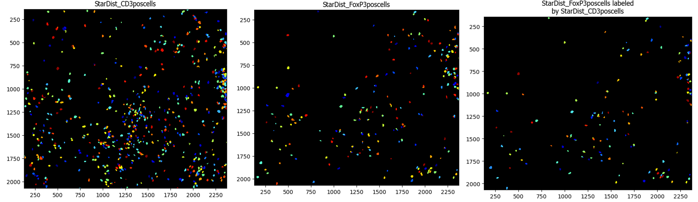

### 12. Overlay Outlines
Checks the accuracy of detecting double positive cells by overlaying the outlines of the CD3+FoxP3+ cells on the grayscale FITC image

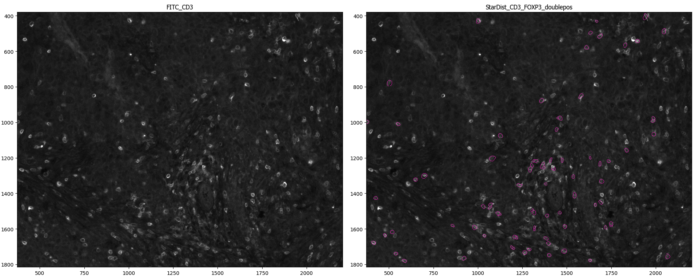

### 13. Measure Object Intensity
Measures intensities of CD3 expression and FoxP3 expression

### 14. Measure Colocalization
Measures the correlation between CD3+ and FoxP3 intensities

### 15. Gray to Color
Creates a color composite image with the three channels - DAPI, FITC, and Foxp3

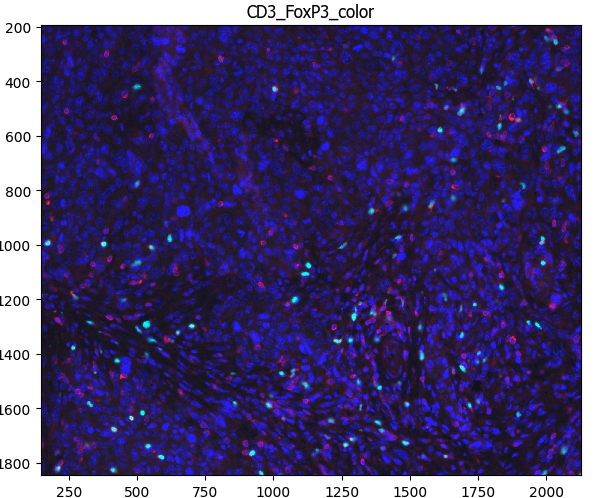

### 16. Overlay Outlines
Creates outlines of doublepositive cells on the merged (composite) image for visualization

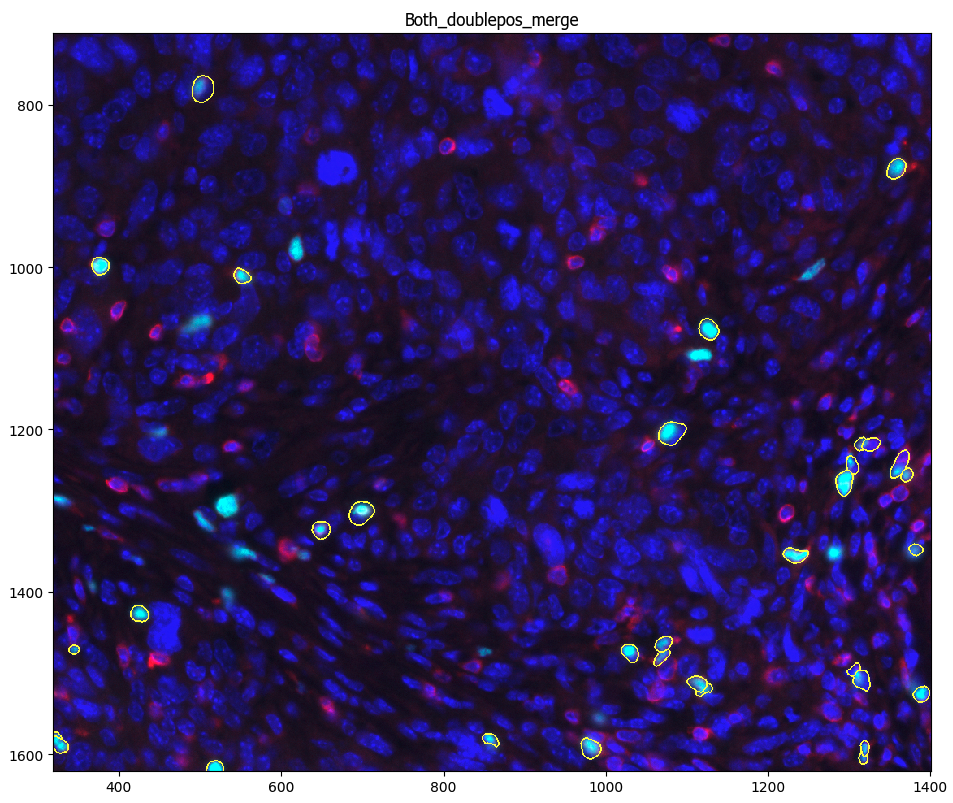

### 17. Save Images
Saves all the overlays to designated folders

### 18. Export to Spreadsheet
Exports all measurements to a spreadsheet for downstream analysis
