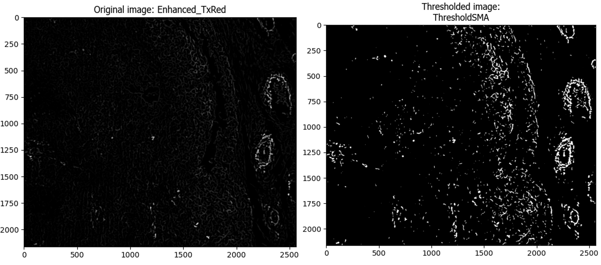

## Description of the purpose of each step of the image analysis pipeline along with example outputs

- [Description of the purpose of each step of the image analysis pipeline along with example outputs](#description-of-the-purpose-of-each-step-of-the-image-analysis-pipeline-along-with-example-outputs)
  - [1. Correct Illumination Calculate and Apply](#1-correct-illumination-calculate-and-apply)
  - [2. RunStarDist](#2-runstardist)
  - [3. OverlayOutlines](#3-overlayoutlines)
  - [4. IdentifySecondaryObjects](#4-identifysecondaryobjects)
  - [5 IdentifyTertiaryObjects](#5-identifytertiaryobjects)
  - [6. IdentifySecondaryObjects](#6-identifysecondaryobjects)
  - [7. IdentifyTertiaryObjects](#7-identifytertiaryobjects)
  - [8. Threshold](#8-threshold)
  - [9. Maskobjects](#9-maskobjects)
  - [10. OverlayOutlines](#10-overlayoutlines)
  - [11. EnhanceOrSuppressFeatures (Neurite)](#11-enhanceorsuppressfeatures-neurite)
  - [12. Threshold](#12-threshold)
  - [13. Maskobjects](#13-maskobjects)
  - [14. OverlayOutlines](#14-overlayoutlines)
  - [15. MeasureImageAreaOccupied](#15-measureimageareaoccupied)
  - [16. MeasureObjectNeighbors](#16-measureobjectneighbors)
  - [17. ConvertObjectstoImage](#17-convertobjectstoimage)
  - [18. ImageMath (Invert)](#18-imagemath-invert)
  - [19. DistanceTransform](#19-distancetransform)
  - [20. GraytoColor](#20-graytocolor)
  - [21. OverlayOutlines](#21-overlayoutlines)
  - [22. Save Images](#22-save-images)
  - [23. Export to Spreadsheet](#23-export-to-spreadsheet)

### 1. Correct Illumination Calculate and Apply
Calculates and applies an illumination function to the images to correct for uneven illumination in the images of SMA-staining. The method 'Background' was selected to correct for the high background staining in some of the images of the SMA-stain (Texas Red).

### 2. RunStarDist
Uses the StarDist algorithm (https://github.com/stardist/stardist) to segment nuclei

### 3. OverlayOutlines
Checks the accuracy of the outlines of the nuclei segmented by RunStarDist

### 4. IdentifySecondaryObjects
Segments the whole cell outlines (for CD8)

### 5 IdentifyTertiaryObjects
Segments cytoplasm (whole cells minus the nuclei) (for CD8)

### 6. IdentifySecondaryObjects
Segments the whole cell outlines (for SMA)

### 7. IdentifyTertiaryObjects
Segments cytoplasm (whole cells minus the nuclei) (for SMA)

### 8. Threshold
Sets the intensity threshold for deeming cells as marker (CD8) positive

### 9. Maskobjects
Keeps the thresholded areas of the image using a mask and identify the cells present in those areas

### 10. OverlayOutlines
Checks the accuracy of detecting CD8+ cells by overlaying the outlines of the CD8+ cells on the grayscale FITC image

### 11. EnhanceOrSuppressFeatures (Neurite)
Enhances thin, elongated areas of the image - this was performed to enable detection of the SMA+ fibroblasts

### 12. Threshold
Sets the intensity threshold for deeming cells as marker (SMA) positive

### 13. Maskobjects
Keeps the thresholded areas of the image using a mask and identifies the cells/nuclei present in those areas

### 14. OverlayOutlines
Checks the accuracy of detecting FoxP3+ cells by overlaying the outlines of the SMA+ cells on the grayscale TexasRed image

### 15. MeasureImageAreaOccupied
Measures the area of image occupied by SMA+ cells

### 16. MeasureObjectNeighbors
Measures the number of CD8+ cells that lie within a radius of 20u, 50u, 100u, and 200u from the SMA+ areas

### 17. ConvertObjectstoImage
Coverts the identified CD8+ cells to a binary image for performing further downstream measurements

### 18. ImageMath (Invert)
Inverts the image such that the darkest pixels become the brightest pixels

### 19. DistanceTransform
description

### 20. GraytoColor
Creates a composite color image merging the DAPI (DNA), FITC (CD8), and Texas Red (SMA) channels

### 21. OverlayOutlines
Overlays the outlines of the CD8+ and SMA+ cells on the composite color image

### 22. Save Images
Saves all the overlays to designated folders

### 23. Export to Spreadsheet
Exports all measurements to a spreadsheet for downstream analysis

