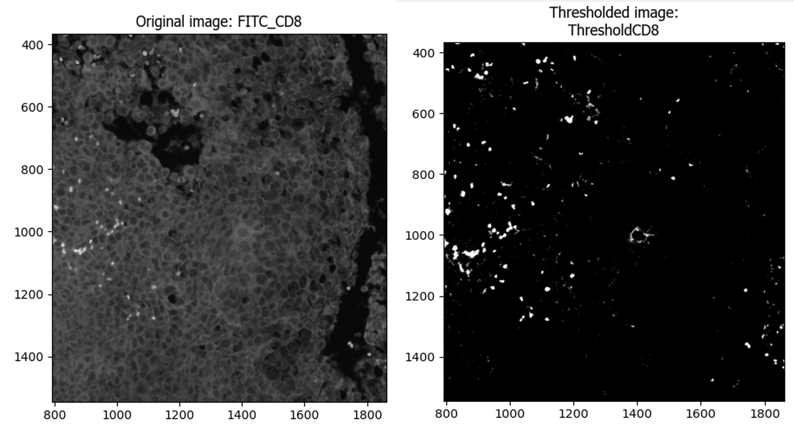

## (WIP) Description of the purpose of each step of the image analysis pipeline along with example outputs

- [(WIP) Description of the purpose of each step of the image analysis pipeline along with example outputs](#wip-description-of-the-purpose-of-each-step-of-the-image-analysis-pipeline-along-with-example-outputs)
  - [1. Correct Illumination Calculate and Apply](#1-correct-illumination-calculate-and-apply)
  - [2. RunStarDist](#2-runstardist)
  - [2. OverlayOutlines](#2-overlayoutlines)
  - [3. IdentifySecondaryObjects](#3-identifysecondaryobjects)
  - [4. IdentifyTertiaryObjects](#4-identifytertiaryobjects)
  - [5. IdentifySecondaryObjects](#5-identifysecondaryobjects)
  - [6. IdentifyTertiaryObjects](#6-identifytertiaryobjects)
  - [7. Threshold](#7-threshold)
  - [8. Maskobjects](#8-maskobjects)
  - [9. OverlayOutlines](#9-overlayoutlines)
  - [10. Threshold](#10-threshold)
  - [11. Maskobjects](#11-maskobjects)
  - [12. OverlayOutlines](#12-overlayoutlines)
  - [13. MeasureImageAreaOccupied](#13-measureimageareaoccupied)
  - [14. MeasureObjectNeighbors](#14-measureobjectneighbors)
  - [15. ConvertObjectstoImage](#15-convertobjectstoimage)
  - [16. ImageMath](#16-imagemath)
  - [17. DistanceTransform](#17-distancetransform)
  - [18. GraytoColor](#18-graytocolor)
  - [19. OverlayOutlines](#19-overlayoutlines)
  - [20. Save Images](#20-save-images)
  - [21. Export to Spreadsheet](#21-export-to-spreadsheet)

### 1. Correct Illumination Calculate and Apply
Calculates and applies an illumination function to the images to correct for uneven illumination in the images of SMA-staining. The method 'Background' was selected to correct for the high background staining in some of the images of the SMA-stain (Texas Red).

### 2. RunStarDist
Uses the StarDist algorithm (https://github.com/stardist/stardist) to segment nuclei

### 2. OverlayOutlines
Checks the accuracy of the outlines of the nuclei segmented by RunStarDist

### 3. IdentifySecondaryObjects
Segments the whole cell outlines (for CD8)

### 4. IdentifyTertiaryObjects
Segments cytoplasm (whole cells minus the nuclei) (for CD8)

### 5. IdentifySecondaryObjects
Segments the whole cell outlines (for SMA)

### 6. IdentifyTertiaryObjects
Segments cytoplasm (whole cells minus the nuclei) (for SMA)

### 7. Threshold
Sets the intensity threshold for deeming cells as marker (CD8) positive

### 8. Maskobjects
Keeps the thresholded areas of the image using a mask and identify the cells present in those areas

### 9. OverlayOutlines
Checks the accuracy of detecting CD3+ cells by overlaying the outlines of the CD3+ cells on the grayscale FITC image

### 10. Threshold
Sets the intensity threshold for deeming cells as marker (FoxP3) positive

### 11. Maskobjects
Keeps the thresholded areas of the image using a mask and identifies the cells/nuclei present in those areas

### 12. OverlayOutlines
Checks the accuracy of detecting FoxP3+ cells by overlaying the outlines of the FoxP3+ cells on the grayscale Cy5 image

### 13. MeasureImageAreaOccupied

### 14. MeasureObjectNeighbors

### 15. ConvertObjectstoImage
Associates the CD3+ cells (parent objects) to the FoxP3+ cells (child objcets)

### 16. ImageMath
Checks the accuracy of detecting double positive cells by overlaying the outlines of the CD3+FoxP3+ cells on the grayscale FITC image

### 17. DistanceTransform

### 18. GraytoColor
Measures the correlation between CD3+ and FoxP3 intensities

### 19. OverlayOutlines
Creates a color composite image with the three channels - DAPI, FITC, and Foxp3

### 20. Save Images
Saves all the overlays to designated folders

### 21. Export to Spreadsheet
Exports all measurements to a spreadsheet for downstream analysis
